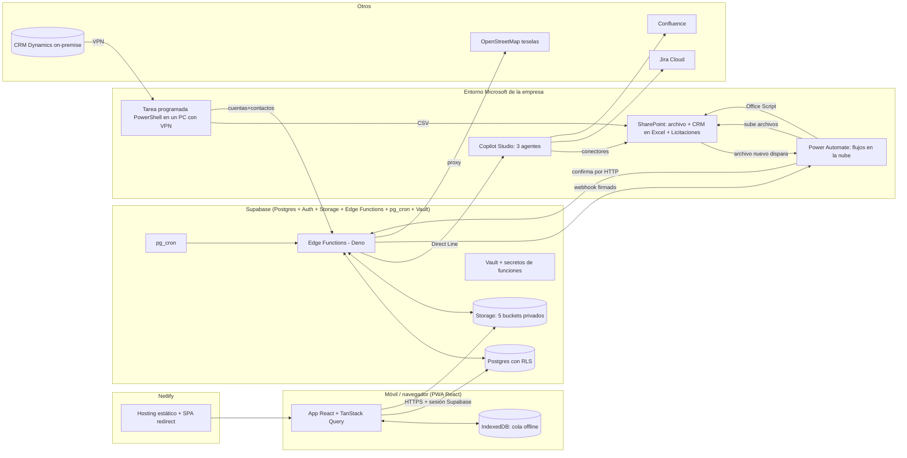

# PrimeNotes (PrimeSuite Comercial) — cómo está diseñado y montado

Documento pensado para pasárselo a otra IA (ChatGPT) como contexto completo. Fecha del estado descrito: **10 oct 2026**.
No contiene claves, contraseñas, URLs con firma, correos, identificadores de entornos/flujos/agentes ni datos de clientes. Donde algo no se ha comprobado se dice «sin comprobar». Los números (tiempos, tamaños) son medidos en el sistema real salvo que se indique lo contrario.

---

## 1. Qué es

**PrimeNotes** es una app web instalable (PWA) para los **comerciales de una empresa de tecnología industrial** (control de accesos, control horario, mantenimiento, proyectos). Sirve para:

- **Preparar** la visita a un cliente (briefing automático con IA, ficha del cliente, repaso).
- **Capturar** durante la visita, también **sin cobertura**: notas, fotos, audios, documentos, hallazgos (lo que el cliente tiene/necesita), oportunidades y próximos pasos.
- **Cerrar** la visita (resumen automático) y que **todo quede archivado** (informe PDF/web en SharePoint, copias de seguridad).
- **Dirección Comercial** ve la actividad del equipo, gestiona comerciales, vocabulario y avisos.

Idioma de la app y de todo el negocio: **español**. Zona horaria del negocio: **Europe/Madrid**.

Roles: `comercial` y `direccion_comercial`. Además, dentro de cada visita: responsable y participantes (aceptados / pendientes / rechazados).

---

## 2. Mapa general (qué habla con qué)



Resumen en una frase: **la app solo habla con Supabase**; Supabase habla con el mundo Microsoft por **dos puertas** (webhooks de Power Automate para archivar y Direct Line para los agentes de IA) y recibe el CRM por una **tercera** (una función con clave propia que sube un PC).

---

## 3. Stack y despliegue

| Capa | Tecnología |
|---|---|
| Frontend | Vite + React + TypeScript; `react-router-dom`; `@tanstack/react-query`; `react-hook-form`; `leaflet` (mapas); `idb` (IndexedDB); `@phosphor-icons/react`; `@sentry/react` (errores); `vite-plugin-pwa` (Service Worker, `registerType: autoUpdate`) |
| Backend | Supabase: Postgres, Auth, Storage, Edge Functions (Deno), `pg_cron`, `pg_net`, `supabase_vault`, `pgcrypto`, `pg_trgm`, `uuid-ossp` |
| Hosting | Netlify (Node 24 en el build). SPA: toda ruta → `/index.html`. Cabeceras de seguridad (X-Frame-Options DENY, HSTS, nosniff, Referrer-Policy). |
| Config | Solo las variables públicas del frontend (URL y clave anónima de Supabase) en la UI de Netlify, por contexto. Nada de secretos en el repo. |
| Calidad | `npm run typecheck`, `npm run lint` (ESLint + un script que exige que toda pantalla de cliente/visita lleve a la vez los iconos de Briefing y «Pregunta a la IA»), `npm run build`. |
| Tipos | `supabase gen types` → `src/types/database.ts`. |

**Flujo de trabajo (obligatorio, escrito en `CLAUDE.md`)**: nunca se trabaja en `main`; cada cambio va en rama `feature/*` → Pull Request → Deploy Preview de Netlify → merge. **`git push` a `main` publica en producción automáticamente** (Netlify tiene auto-publish), por eso solo se hace cuando el dueño escribe la frase literal «HAZ DEPLOY A PRODUCCIÓN». Las migraciones y Edge Functions de Supabase se despliegan aparte (no pasan por Netlify) y la **base de datos es la misma para pruebas y producción** (no hay entorno de staging de datos): por eso las pruebas usan un cliente de prueba y se borran después.

---

## 4. Modelo de datos (Postgres, esquema `public`)

35 tablas, 10 vistas, **82 políticas RLS** (todas las tablas tienen RLS activada), 82 funciones `fn_*`, migraciones numeradas hasta la 158 en `supabase/migrations/`.

### 4.1 Núcleo comercial
```
cliente ─┬─ proyecto ── visita ─┬─ captura_libre   (tipo: foto | audio | nota | documento)
         │                      ├─ hallazgo ── hallazgo_area ── termino / categoria_vocabulario
         │                      ├─ oportunidad ── oportunidad_area / oportunidad_termino / oportunidad_visita_seguimiento
         │                      ├─ proximo_paso
         │                      ├─ visita_participante   (responsable / participantes, estado de la invitación)
         │                      ├─ visita_interlocutor ── interlocutor ── cliente
         │                      ├─ zona_visita           (zonas de texto libre creadas al usarlas)
         │                      └─ visita_solicitud_reapertura
         └─ ubicacion
```
- `visita.estado_captura`: `agendada` → `en_curso` → `consolidada` (= cerrada). Se puede **reabrir** (el responsable y Dirección directamente; el resto por solicitud). `cierre_automatico` marca las cerradas por inactividad.
- `oportunidad.etapa`: `latente | cualificada | en_propuesta | cerrada`.
- Un **proyecto** agrupa visitas de un cliente; las visitas «viven» dentro de su proyecto. Estado de proyecto: solo activo/terminado.
- **Vocabulario («ecosistema»)**: catálogo jerárquico de categorías y términos (tecnologías/modelos). Los hallazgos se etiquetan con él; una vista materializada `vw_ecosistema_actual_cliente` (refrescada por cron cada 10 min) resume «lo que el cliente TIENE». Hay cola de propuestas de término nuevo que Dirección resuelve (`cola-vocabulario`).
- Clientes duplicados: se detectan y se fusionan (`fn_fusionar_cliente`); alta con aviso de parecido y bloqueo de duplicado fuerte.

### 4.2 CRM espejo (solo lo imprescindible)
- `crm_cuenta` y `crm_contacto`: **solo cuentas y contactos** del CRM se copian a Supabase (para el buscador de alta, vincular cuenta y mostrar interlocutores). **Oportunidades y ofertas del CRM NO se guardan en Supabase** (decisión de privacidad/arquitectura: los datos comerciales finos se quedan en el entorno Microsoft). `cliente.crm_accountid` vincula un cliente propio a su cuenta (índice único: una cuenta = un cliente activo).

### 4.3 IA y colas
- `briefing_visita` (uno por visita: estado `pendiente|generando|listo|error|sin_cuenta`, contenido en Markdown), `briefing_tarea` (las conversaciones de IA de un briefing: lecturas por fuente y redacción), `briefing_cache_fuente` (caché 24 h de una lectura lenta), `briefing_uso` (para el tope diario).
- `consulta_ia`: cola de «Pregunta a la IA» (pregunta, respuesta, estado, tiempos).
- `ajustes_app`: interruptores y topes (ver §9).

### 4.4 Archivado y copias
- `captura_libre` guarda también dónde está el binario (`ubicacion_archivo`), la ruta en SharePoint, intentos y error del archivado, nombre original, mime, bytes, `desde_galeria`.
- `registro_backup_completo`: estado de cada copia de seguridad de tablas.

### 4.5 Seguridad en base de datos
- Sesión por Supabase Auth; `comercial.id` = `auth.users.id`. Funciones auxiliares (`fn_rol_actual`, `fn_es_participante_de_visita`, `fn_es_responsable_de_visita`, `fn_puede_consultar_cliente`…) alimentan las políticas RLS.
- Las acciones sensibles son funciones `SECURITY DEFINER` con comprobación de permiso dentro.
- Las **colas de IA y archivado solo las escribe el servidor** (service role); el usuario las dispara con RPC (`fn_pedir_briefing`, `fn_preguntar_ia`).
- Toda función pública para un cron/webhook valida una **clave de worker** guardada en Vault (`fn_clave_worker_valida`).

---

## 5. Frontend

- **Pantallas** (rutas): Hoy/Agenda, Planificar, Clientes (lista, alta rápida, ficha, repaso), Proyecto (ficha), Visita (planificada / activa / cierre / detalle cerrada), Captura, Hallazgo, Oportunidad, Próximo paso, Mis tareas, Yo (perfil, avisos, copia de seguridad), Mi espacio (consumo de almacenamiento), Ayuda (manual), y las de **Dirección**: Briefings (uso), Sectores, Actividad de comerciales, Comerciales (alta/baja), Vocabulario, Solicitudes de reasignación, Deduplicación, Clientes por vincular.
- **Offline**: toda escritura de una visita en curso pasa por una cola en **IndexedDB** (una sola base y un solo almacén). Se sincroniza en orden de creación respetando dependencias (cliente → proyecto → visita → hallazgo/captura…), con reintentos con retroceso (3, 6, 12, 24, 30 s; 5 intentos). Las fotos/audios se guardan como `ArrayBuffer` (los `Blob` grandes de IndexedDB fallan en Safari de iOS al reescribir el registro). La resolución de conflictos es «último gana» (lo capturado es casi todo de solo añadir).
- **Navegación**: el ← nunca es `navigate(-1)`; cada pantalla de detalle recibe su origen y lo recuerda (`useVolverA`). Filtros de listas en la URL. Estado de vistas plegables recordado al volver. Hojas emergentes siempre desde arriba. Borrar = deslizar la fila o papelera en cabecera (nunca botón al final).
- **Ayuda in-app** centralizada en un diccionario tipado (`src/lib/ayuda.ts`) que se actualiza en el mismo commit que la pantalla; tour guiado.
- **Sistema de diseño** documentado (`docs/08_sistema_diseno.md`): filas, jerarquía, hojas, avisos, accesibilidad (nada se entiende solo por el color).
- **Subida de archivos** a la visita (un solo botón de galería: fotos, audios, documentos): fecha y GPS salen del **EXIF de la propia foto** (leído antes de comprimir porque el canvas lo borra); nunca la posición actual; tope 30 por vez; avisos de repetida/lejos/fecha distinta; en visita en curso va por la cola offline, en cerrada es directo.
- **Límites de subida** (servidor): fotos 15 MB, audios 30 MB, documentos 25 MB (PDF, Word, Excel, PowerPoint, TXT, CSV). Cuota total de almacenamiento del equipo («el pozo»).

---

## 6. Edge Functions (Supabase, Deno) — 11

| Función | Quién la llama | Qué hace |
|---|---|---|
| `procesar-briefings` | `pg_cron` cada minuto (si hay algo vivo) y `fn_pedir_briefing` al instante | Worker del briefing: abre conversaciones de Direct Line con los agentes, las sondea cada 4 s, junta resultados y guarda el briefing. Responde al instante y sigue en segundo plano (`EdgeRuntime.waitUntil`). |
| `procesar-consultas` | `fn_preguntar_ia` al instante + cron | Igual para «Pregunta a la IA» (una conversación, respuesta corta con «Fuente:»). |
| `procesar-archivado-sharepoint` | cron cada 10 min | Copia a SharePoint lo de las visitas cerradas (webhook de Power Automate), genera el informe PDF/web, y libera originales de Storage a los 30 días. |
| `confirmar-archivado-sharepoint` | el flujo de Power Automate, una vez por archivo | Comprueba que SharePoint guardó los mismos bytes y anota la copia. No borra nada. |
| `generar-backup-visita` | la app (descargas), el worker de archivado | PDF (pdfmake), informe web navegable (un `.html` con mapa) y ZIP de originales en trozos de ~40 MB. |
| `generar-informe-proyecto` | la app | PDF de un proyecto con su cronología de visitas cerradas. |
| `generar-copia-seguridad` | cron diario 03:30 UTC o Dirección | JSON de 23 tablas, **cifrado** (AES-GCM + RSA-OAEP, solo la clave pública está en el servidor) → bucket temporal → webhook de Power Automate → SharePoint. Solo actúa si no hay copia confirmada de menos de 7 días. |
| `obtener-url-archivo-sharepoint` | la app | Devuelve el contenido de una captura ya archivada en SharePoint (permiso = el de la RLS del usuario). |
| `sincronizar-cuentas-crm` | el PC con VPN | Recibe cuentas (y con `?tabla=contactos`, contactos) y hace upsert; autenticación por clave propia, distinta de la de servicio. |
| `gestionar-comercial` | Dirección desde la app | Alta/edición/baja de comerciales (el único punto con clave de servicio para Auth). Baja: si no tiene historial se borra del todo; si lo tiene se conserva y se anonimiza el correo. Enlaces de acceso de un solo uso (sin contraseñas en claro). |
| `tile-mapa` | el informe web (sin sesión) | Proxy de teselas de OpenStreetMap con el User-Agent/Referer que exige su política (las páginas descargadas no mandan Referer y OSM las bloqueaba). |

Compartido (`_shared`): cifrado de copias, informe HTML/PDF, reducción de imágenes, limpieza de backups, enlaces, logo/fuente.

**Jobs `pg_cron` activos:** `procesar-briefings` y `procesar-consultas` (cada minuto, solo si hay trabajo), `procesar-archivado-sharepoint` (10 min), `refrescar-ecosistema-actual` (10 min), `cerrar-visitas-inactivas` (cada hora), `marcar-capturas-error` (cada hora), `briefings-nocturnos` (20:00 hora del servidor, UTC por defecto: encola el briefing de las visitas planificadas para mañana), `copia-seguridad-diaria` (03:30 UTC).

---

## 7. Integración con Microsoft (donde más ha costado)

### 7.1 Restricciones reales del entorno (decididas por el dueño; condicionan todo)
- **Sin Entra ID / app registration** ni ayuda de TI.
- **Sin licencia premium** de Power Platform/Copilot Studio: ni lanzamiento programado de flujos de escritorio, ni flujos de nube como herramienta de agente, ni conectores premium.
- El CRM (Dynamics on-premise) solo es accesible **con VPN desde un PC de la empresa**.
- Todo corre con la **identidad de una cuenta personal** de la empresa (punto único de fallo conocido y asumido; el flujo falla en silencio si esa cuenta cambia de contraseña o licencia).

### 7.2 Carga diaria del CRM (sin Power Automate programado)
1. **Tarea programada de Windows** «PrimeNotes - CRM diario» (lunes a viernes 08:30; si el PC estaba apagado, al encenderlo). Script PowerShell: descarga Contactos, Oportunidades, Ofertas y Cuentas del CRM (mismos `fetchXml`/columnas que antes hacían 4 flujos de Power Automate Desktop) y deja `CSV` por partes en una carpeta de SharePoint sincronizada con OneDrive.
2. El CSV de **Cuentas** (el último en subirse) **dispara un flujo de nube** «CRM a Excel» que ejecuta un **Office Script** y vuelca cada CSV en una tabla de un **libro Excel** en SharePoint (`PrimeNotes_CRM.xlsx`, hojas Cuentas / Contactos / Oportunidades / Ofertas). Las columnas `_x_value` pierden el guion bajo inicial (el filtro OData del conector Excel no las admite) y todo se guarda como texto.
3. El mismo script sube **cuentas y contactos** a Supabase (`sincronizar-cuentas-crm`). Ese libro Excel es la fuente que leen los agentes.
- Límite: depende de un PC encendido y con VPN; no hay aviso si no se carga (pendiente: «datos del CRM al <fecha>» en el briefing y aviso si pasan >2 días).

### 7.3 Archivado a SharePoint (fotos, audios, documentos, informes)
- **Estructura**: cliente primero (no comercial primero): `PrimeNotes - Comerciales/<cliente>/<proyecto>/<visita>/…`. Se usan siempre ids; las carpetas se fijan la primera vez (renombrar un cliente no parte su historial).
- **Fase 1 (al cerrar la visita)**: el worker genera URLs firmadas cortas de Storage y llama al webhook del flujo «Archivar visita a SharePoint»; el flujo sube cada archivo y llama a `confirmar-archivado-sharepoint`, que compara tamaños. Idempotente (no duplica si nada cambió; huella del contenido para «reabrir y volver a cerrar»). Reintentos hasta 5 veces por archivo.
- **Fase 2 (≥30 días tras el cierre y ≥1 día tras la copia)**: se borra el original de Storage (fotos/audios) y la fila apunta a SharePoint. Interruptor `archivado_liberar_activo`.
- Cada visita cerrada deja además un **informe PDF y un informe web (HTML navegable con mapa y menú por tipo/zona)** en su carpeta.
- Pantallas de vigilancia para Dirección (Yo → Gestión → «Copia a SharePoint»).
- **Copia de seguridad de las tablas**: flujo propio «Subir copia de seguridad» → carpeta fija de SharePoint; flujo «Rotar copias» semanal (conserva las 8 más recientes). Restauración: solo probado el formato, **sin procedimiento de restauración real probado**.
- Trampas aprendidas en Power Automate (costaron horas): ver §11.

### 7.4 Agentes de IA (Copilot Studio) + Direct Line

Hay **tres agentes**. Todos usan «Sin autenticación» + acceso protegido por **secreto de Direct Line** (cada uno con el suyo, guardado como secreto de Edge Functions) y **credenciales del fabricante** en sus herramientas (cuenta compartida). Endpoint **europeo** de Direct Line (el global da 403).

| Agente | Motor | Modelo | Herramientas | Uso |
|---|---|---|---|---|
| **Briefing Comercial de Clientes** (original) | «GitHub Copilot» (editor nuevo, razona paso a paso) | Claude Sonnet 5 | CRM (Excel «Enumerar filas»), Licitaciones (SharePoint «Mostrar lista de carpetas»), Jira, Confluence | Briefing completo en un solo agente: **~300–360 s** medidos. Sigue siendo el camino activo en producción. |
| **Consultas comerciales CB** | **Estándar** (clásico) | Claude Sonnet 4.6 | CRM Excel, Licitaciones (listar carpetas + obtener contenido de archivo por ruta), Jira (listar + incidencia por clave), Confluence (páginas + contenido) | «Pregunta a la IA» (respuesta corta con «Fuente:») y **lector** del briefing rápido. ~17–30 s por pregunta. |
| **Redactor Briefing CB** | Estándar | GPT-5.5 Chat (categoría «General», la más rápida) | **Ninguna** (recibe los datos y las instrucciones dentro del mensaje) | Redacta el briefing. 10–20 s. |

**Cómo funciona un briefing hoy (camino rápido, detrás del interruptor `briefing_rapido_activo`, apagado en producción hasta aprobar la calidad):**
1. Disparadores: botón «Generar/Actualizar» (arranque inmediato), al planificar una visita de los próximos 7 días, y cada noche para las visitas de mañana. Tope diario 50 y bloqueo de 1 h tras el último generado.
2. El worker crea tareas y lanza **4 conversaciones de Direct Line en paralelo** contra el agente de Consultas, una por fuente: oportunidades del CRM, ofertas del CRM (recortadas a 25 filas y 8 columnas), carpetas de Licitaciones (con **caché de 24 h** por cuenta: 0 s si está) y Jira. Cada una pide «solo filas separadas por « | » y acabar con `FIN-LECTURA`». Plazo por fuente; si una no llega, el briefing sale sin ella y lo dice.
3. Datos **sin IA** (SQL, 0 s): cuenta y contactos del CRM espejo + lo que ya consta en PrimeSuite (últimas visitas con su resumen, próximos pasos pendientes, oportunidades en seguimiento, interlocutores).
4. Con todo ello se arma **un único mensaje** (instrucciones + datos) al agente Redactor, que devuelve el briefing en Markdown con 8 secciones: *Lo que tienes que saber · Objetivo de la visita · Preguntas · Dinero abierto · Avisos · Última visita y pendientes · Personas · Historial* (≈45 líneas, regla «cada dato una sola vez»). Salvaguardas en código: se limpian marcas internas e importes con más de 2 decimales; el modelo tiene prohibido sumar o calcular totales (inventaba cifras distintas cada vez).
5. Tiempo medido con un cliente de prueba: **58–79 s con la caché de Licitaciones, 96–116 s en frío**, frente a 361 s del camino original.
- Comprobación automática tras cada cambio de prompt/columnas (SQL): todas las referencias e importes del briefing existen en los datos de entrada, sin identificadores internos, sin marcas, la oportunidad del objetivo aparece en «Dinero abierto».
- Datos del CRM: **no hay API**; los agentes leen el Excel. El agente **inventó ids** en pruebas de septiembre → regla «relacionar solo por id exacto» y filtros siempre por id de cuenta.

**«Pregunta a la IA»**: la app inserta una fila en `consulta_ia` (RPC), el worker abre una conversación con el agente de Consultas con el mensaje `Cliente: <nombre> (id de cuenta <id>). Pregunta: <texto>`, sondea y guarda la respuesta. Tope por usuario y día (20). Puede cancelarse.

### 7.5 Lo que NO funciona en este tenant (probado; no repetir)
| Intento | Resultado |
|---|---|
| Flujo de Power Automate clásico como herramienta de un agente | `AuthenticationNotConfigured` (es función premium). Un flujo roto en un turno **contamina las demás herramientas** de ese turno → desactivados. |
| «Agent Flow» nativo | Crear uno redirige a un entorno inaccesible (error de plataforma). |
| Acción genérica «HTTP a SharePoint» como herramienta | Igual que los flujos (premium). Sí funcionan las acciones acotadas del conector. |
| Knowledge de SharePoint (RAG nativo) | Exige autenticación de Entra del agente completo (sin TI no se puede) y limita a 1.000 archivos por fuente. |
| Dataverse como almacén | Sin permiso para crear tablas. |
| Lectura de documentos por OCR de AI Builder | Funcionaba pero es premium; se descubrió que «Obtener contenido de archivo por ruta» ya extrae texto de PDF/Word/Excel sin conversión. |
| Pedir al agente que cuente totales/sume | Inventa. Prohibido por prompt y vigilado. |
| Partir la lectura de Licitaciones en 2 lectores en paralelo | Empeoró (más lento). Revertido. |
| Un agente por comercial | Descartado: las cuotas de Copilot Studio son por entorno, no por agente. |

---

## 8. Seguridad y privacidad (diseño)

- Todo bucket es **privado**; la app firma URLs cortas. RLS en todas las tablas; un invitado «pendiente» a una visita no ve ni sube nada.
- Secretos: **Vault de Supabase** (clave de workers, URLs firmadas de los webhooks de Power Automate) y **secretos de Edge Functions** (claves de Direct Line de los tres agentes, clave de sincronización del CRM, clave pública de cifrado de copias). La clave privada de las copias no está en el servidor (según notas del proyecto, sin comprobar ahora; su segunda copia es una tarea pendiente).
- Funciones llamadas por cron/webhook: `--no-verify-jwt` con autenticación propia (clave en cabecera o campo firmado). La clave del PC del CRM solo sirve para subir cuentas y se puede rotar sin tocar nada más.
- **Datos de clientes no salen del entorno Microsoft/Supabase de la empresa**; en Supabase solo cuentas y contactos del CRM. El consumo de IA va por la cuenta corporativa. Quien pregunta a la IA queda registrado y hay topes.
- Copias de seguridad cifradas antes de salir del servidor; en SharePoint la carpeta de copias debe tener herencia de permisos rota (solo Dirección/TI) — tarea manual pendiente.
- Dar de baja a un comercial cierra sus sesiones (`fn_cerrar_sesiones`) y la app lo saca al login si lo detecta.

---

## 9. Interruptores y topes (`ajustes_app`)

| Clave | Estado actual | Qué hace |
|---|---|---|
| `briefing_rapido_activo` | **apagado** | Camino rápido del briefing (§7.4). |
| `briefing_pausado` | apagado | Detiene encolado automático de briefings. |
| `briefing_tope_diario` | activo, 50 | Máximo de briefings por día. |
| `consulta_ia_tope_usuario` | activo, 20 | Preguntas a la IA por usuario y día natural de Madrid. |
| `archivado_informe_activo` | **encendido** | Genera/copia el informe de cada visita cerrada. |
| `archivado_liberar_activo` | apagado | Borra originales de Storage a los 30 días (se enciende solo con la app que sabe abrir archivados). |
| `archivado_dias_liberar` | 30 | Días hasta liberar. |
| `visita_autocierre_horas` | apagado (18 h) | Cierra visitas con algo capturado y sin actividad. |
| `espacio_manual_activo` | apagado | Oculta la liberación manual de espacio. |
| `clasificacion_detallada` | apagado | Interruptor de Dirección (se maneja desde la pantalla de Vocabulario) que leen los 3 formularios de captura de hallazgo/oportunidad/nota; efecto exacto sin comprobar en este documento. |

---

## 10. Cómo se ha trabajado (método) — útil para que otra IA no repita errores

Reglas del proyecto (en `CLAUDE.md` y `docs/crm-copilot/guia-crear-agentes.md`):
- **Antes de tocar un agente, flujo, cron o webhook**: leer la documentación oficial y los problemas conocidos; probar por capas (solo leer → acción con datos de prueba → valor real); anotar en el repo todo lo que se cree en un sistema externo.
- **Bug = clase de bug**: se barre toda la app y se arreglan todos los sitios a la vez.
- **Cliente de prueba** y borrado de los datos de prueba al acabar (la base es la misma que producción).
- No inventar ni suponer: todo se comprueba con SQL/navegador antes de afirmarlo; las notas no son hechos.
- Medir por la cola real (columnas de inicio/fin de las filas), no cronometrando la pantalla.
- Documentación viva: `docs/` (diseño del archivado, operación/guardia, copia de seguridad, cierre automático, documentos de visita, subida de archivos, sistema de diseño, plan y mediciones del briefing rápido, guía de agentes, instrucciones versionadas de cada agente).

---

## 11. Lecciones técnicas (trampas encontradas)

**Power Automate / SharePoint**
- Añade 3 bytes (BOM) a archivos que llegan como `application/json`: subir como `application/octet-stream`.
- En «Delete file» el campo File Identifier es un selector: una expresión escrita queda como texto literal → «NotFound»; solo vale contenido dinámico. Un identificador dentro de un bucle sobre `skip(...)` crea un bucle interior sobre toda la lista y borra todo.
- «Save As» de un flujo lo deja apagado y con URL de disparador nueva.
- El disparador «Week» del diálogo de creación puede guardarse como «Minute».
- «Create file» no sobrescribe; hay que prever nombres repetidos.

**Copilot Studio**
- Dos motores: *estándar* (rápido, acotado) y *GitHub Copilot* (razona paso a paso, explora y reintenta: para tareas simples añade latencia sin mejorar el resultado). Un agente no se convierte de uno a otro: se rehace.
- Varias herramientas elegidas en un turno se llaman **en secuencia**; el paralelismo se consigue con varias conversaciones de Direct Line desde el servidor.
- Un agente **sin herramientas ni conocimiento** no responde (cae en «No se encontró información») salvo que se active «Permitir respuestas sin fundamentación».
- Un agente nuevo viene con «Autenticar con Microsoft», que Direct Line no admite (`IntegratedAuthenticationNotSupportedInChannel`).
- Entradas de herramienta: lo fijo → «Valor personalizado»; si se deja a la IA, el agente pregunta y por Direct Line se cuelga.
- Instrucciones máx. 8.000 caracteres (recomendado muy cortas); el panel «Probar» limita el mensaje a 2.000 (Direct Line, 256K).
- Cuotas por entorno (50–100 peticiones generativas/min según plan).
- El tiempo de generación es proporcional a los **tokens de salida**; la entrada casi no cuenta. Modelos de categoría «General» son los rápidos.

**Direct Line**
- Con `?watermark=` solo devuelve actividades nuevas → acumular entre sondeos. `turn.complete` no llega siempre: usar una marca final explícita en la respuesta.
- No dejar una petición de cron esperando (la sondeadora larga bloqueó las llamadas siguientes de `pg_net`): responder ya y seguir con `EdgeRuntime.waitUntil`.

**Supabase / Postgres**
- Edge Functions: 150 s de reloj en el plan gratuito, 400 s en el de pago, 2 s de CPU; los buckets no admiten objetos >50 MB (ZIP en trozos).
- Añadir una clave foránea nueva hacia una tabla ya embebida por PostgREST vuelve **ambigua** la consulta (`tabla:columna(...)`): usar el nombre de la FK.
- Un `insert` con filas de distinta forma rellena con `null` las columnas ausentes: dar a todas las filas las mismas columnas.
- Dos pasadas simultáneas de un worker duplicaban tareas: índice único + inserción idempotente.
- Generar PDF: `@react-pdf/renderer` no arranca en Deno; se usa `pdfmake`.

**iOS / PWA**
- Safari de iOS invalida los `Blob` grandes de IndexedDB al reescribir el registro → guardar `ArrayBuffer`.
- iOS entrega las fotos HEIC de la galería ya como JPEG con EXIF y GPS (medido en simulador).
- Páginas descargadas (`blob:`) no mandan `Referer` → proxy de teselas.

---

## 12. Estado actual y pendientes (10 oct 2026)

**En producción** (rama `main`): todo lo anterior salvo el camino rápido del briefing, que está desplegado pero **apagado**.

**Pendiente / abierto**
1. **Aprobar la calidad del briefing rápido** (lo debe leer una persona) y encender `briefing_rapido_activo`.
2. **Incidencias «que queman» y desarrollos sin entregar** no aparecen en el briefing: hoy Jira solo se consulta por «actualizadas en 90 días» con 4 campos. Falta leer incidencias **abiertas sin límite de fecha** (prioridad, tipo, responsable, antigüedad) y decidir cómo se marca en Jira un desarrollo pendiente de entregar.
3. Caché de Licitaciones y Jira: 24 h; sin medir qué pasa con muchos comerciales a la vez (cuota generativa del entorno).
4. Restauración real de una copia de seguridad (solo probado el formato); segunda copia de la clave privada de cifrado; permisos de la carpeta de copias.
5. Aviso cuando el CRM no se carga (dependencia de un PC con VPN) y «datos del CRM al <fecha>».
6. Cuenta de servicio o segundo propietario de los flujos/agentes (hoy todo va con una cuenta personal).
7. Encender `visita_autocierre_horas` y después `archivado_liberar_activo`.
8. Probar en iPhone físico (se ha probado en simulador y navegador de escritorio).
9. Borrar en SharePoint lo que la app no borra (la app no borra nada en SharePoint al borrar una visita/cliente: decisión pendiente).

---

## 13. Qué pedirle a ChatGPT con este documento (sugerencias)

- «Revisa la arquitectura y dime los puntos únicos de fallo y cómo reducirlos sin licencia premium ni Entra ID.»
- «Propón un diseño para leer incidencias abiertas y desarrollos pendientes de Jira en el briefing, sin añadir latencia (lecturas en paralelo, caché).»
- «Propón una estrategia de pruebas automáticas para los workers de Direct Line y el briefing (regresión de fidelidad de datos).»
- «Revisa el modelo de datos y las políticas RLS en busca de huecos.»
- «Qué métricas y alertas pondrías para detectar que el CRM, el archivado o los agentes han dejado de funcionar.»

Si necesita más detalle, que lo pida por apartado; los textos de los prompts de los agentes (sin datos) están versionados en `docs/crm-copilot/`.
